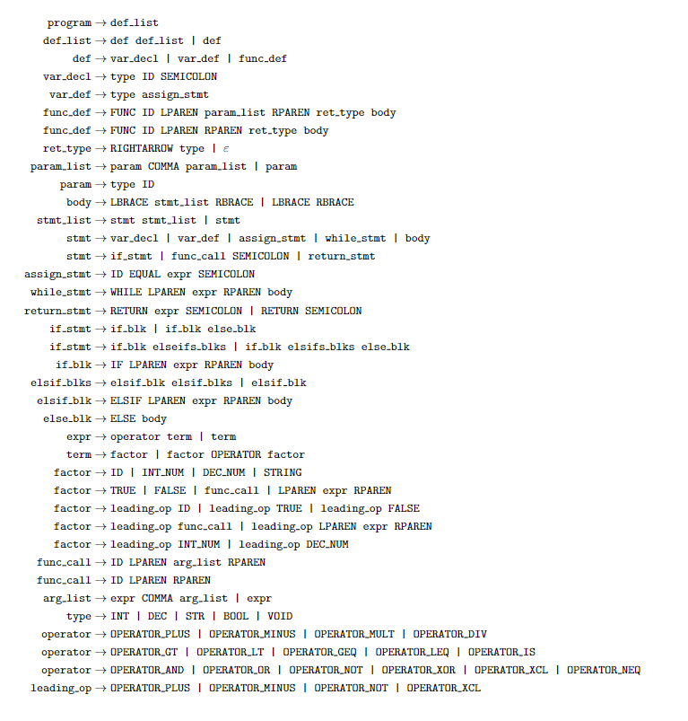

# SunLang

SunLang is a simple programming language created during the winter break of 2021 by Yasser Dbeis and Briggs Richardson. It sports a C-like syntax with a focus on simplicity and ease of use.

## Overview

Built entirely from scratch, SunLang reflects our journey of hands-on exploration and collaborative learning. The project serves as a testament to our commitment to building a programming language with minimal external resources.

## Key Features

- **C-Like Syntax:** Familiar structure for developers versed in C, C++, or Java.
- **Procedural Paradigm:** Supports procedural programming with functions, loops, and conditional statements.
- **Learning-Focused:** Embraced challenges, learning through experimentation, and discovering solutions organically.

## Project Structure

SunLang follows a traditional compiler construction process:

1. **Lexer:** Performs lexical analysis on the source code.
2. **Parser:** Builds the abstract syntax tree (AST) for code representation.
3. **Compiler:** Transforms the AST into assembly-like nodes for execution.

## Language Grammar

Explore the detailed syntax and grammar of SunLang. The grammar provides an in-depth guide to the language structure and rules.

## Try It Out

Explore SunLang interactively using the online interpreter on our [website](https://sunlang.org). Find more details in the documentation available on the site.

## License

This project is licensed under the [MIT License](LICENSE).